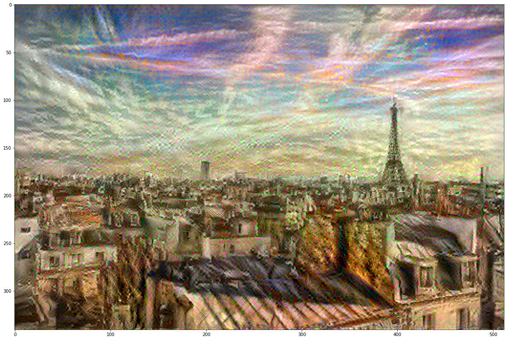

# Neural Style Transfer Using Tensorflow

## Introduction:
Neural style transfer is an optimization technique used to take two images—a content image and a style reference image (such as an artwork by a famous painter)—and blend them together so the output image looks like the content image, but “painted” in the style of the style reference image.

The following is an implementation of Neural Style Transfer from the paper [A Neural Algorithm of Artistic Style](http://arxiv.org/abs/1508.06576) in Tensorflow using the VGG-19 model

## Guide:

1. Clone the repo into the working directory and move into it using
  ``` 
  $ git clone https://github.com/green-mint/Neural-Style-Transfer-using-Tensorflow.git
  $ cd Neural-Style-Transfer-Using-Tensorflow 
  ```
2. Using python run the `nst.py` file with `path/to/output/image/jpg` as a required argument. Additional arguments `path/to/content/img.jpg` and `path/to/style/image` are optional. If not provided default content and style images (as shown below) will be used
  ```
  $ python nst.py path/to/output/image/jpg [path/to/content/img.jpg] [path/to/style/image]
  ```
3. For more control you can change `EPOCHS` and `WEIGHT` variables, higher weight tend to give more precedence to the associated property.

## Example: 
For testing purposes, the style was extracted from the style image (left) and used to manipulate the content image (right).

 

After 100 interations


